## Demo    
<h3 align="center"> Search Screen </h3>

    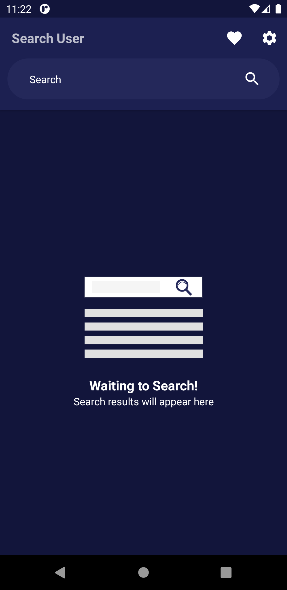
    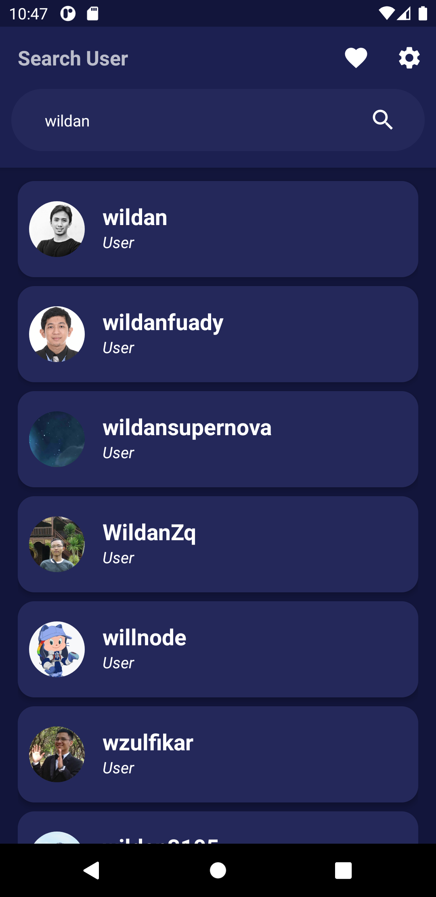
    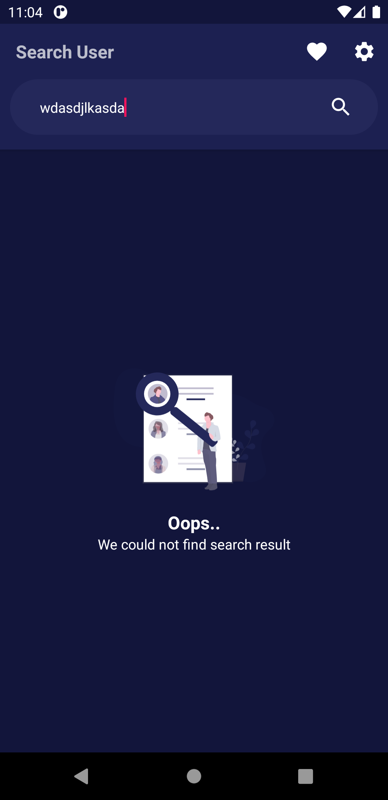

<h3 align="center"> Notification Reminder </h3>

    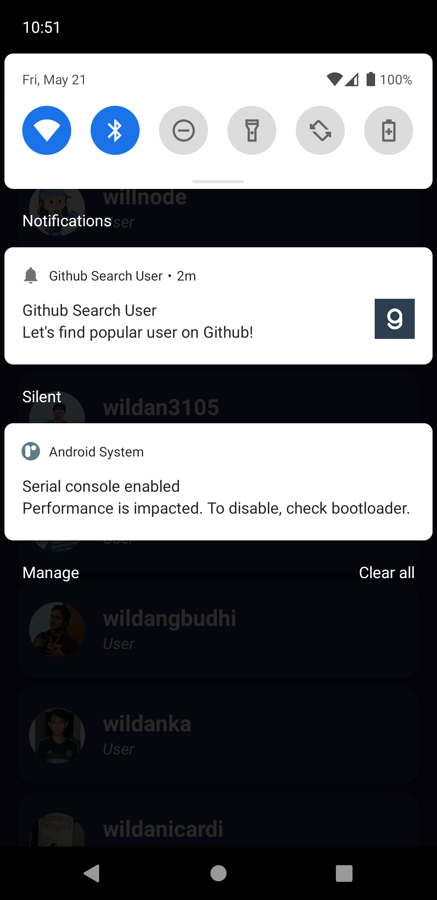

<h3 align="center"> Profile Screen </h3>

    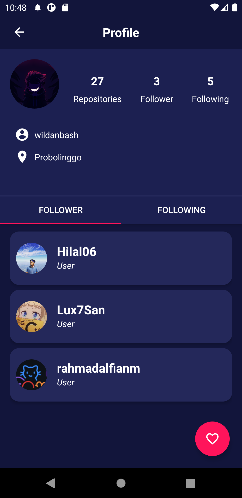
  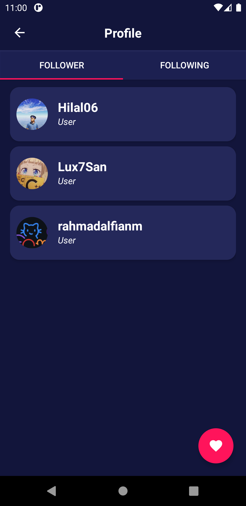
  
  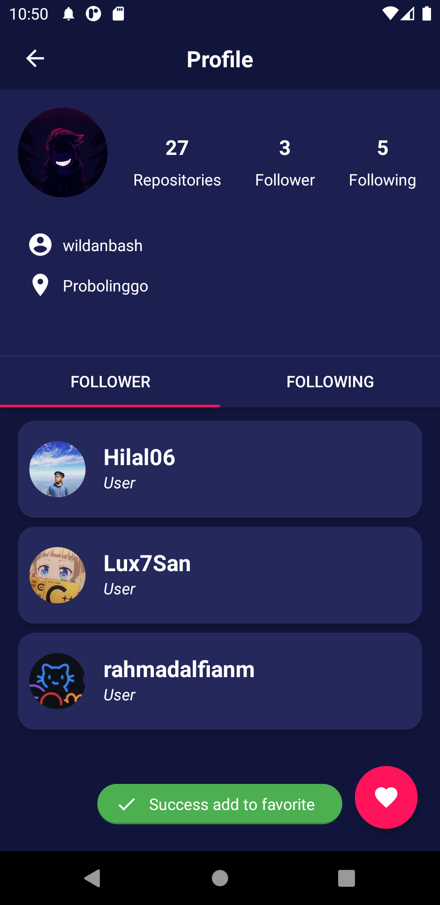
  

<h3 align="center"> Favorite Screen</h3>

    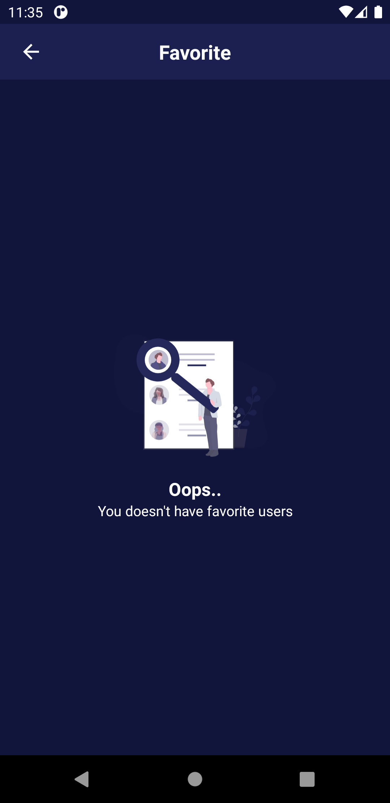
  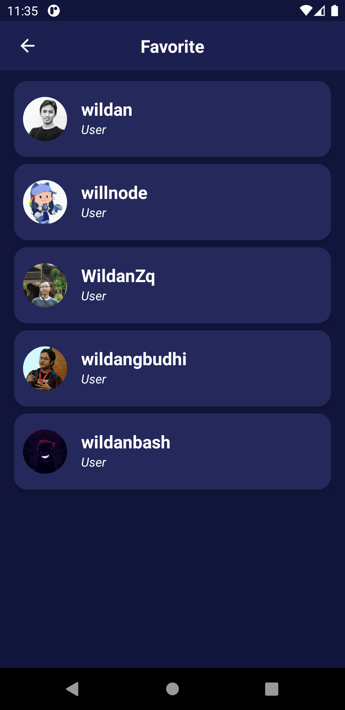

<h3 align="center"> Setting Screen</h3>

    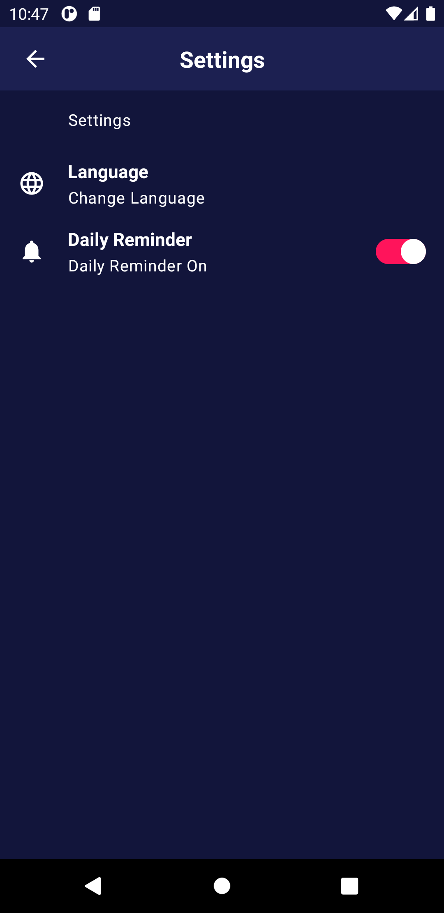
  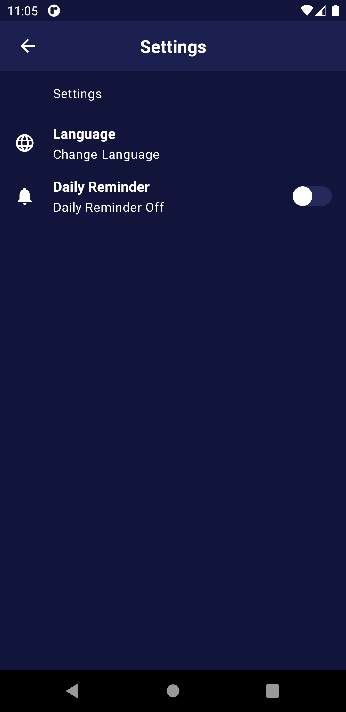

<h3 align="center">Widget</h3>

    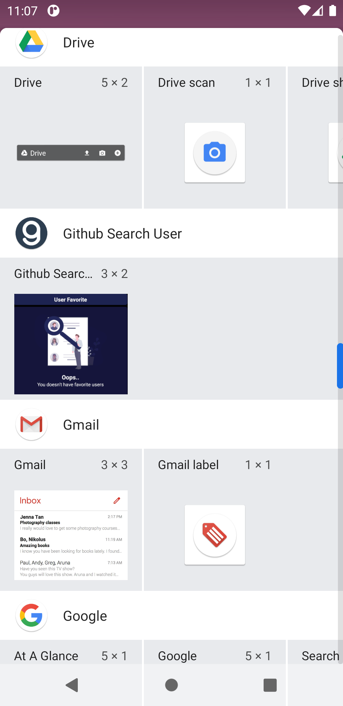
  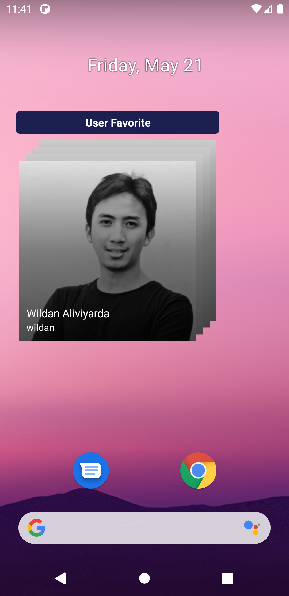
  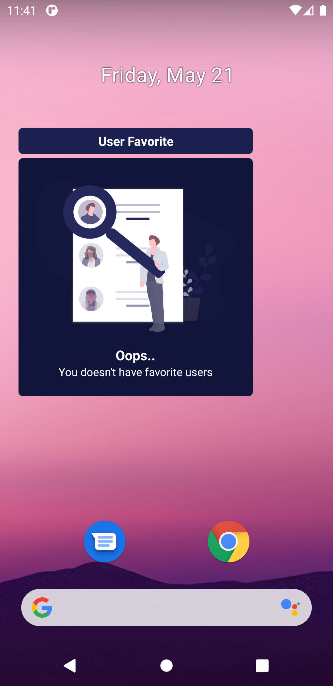

